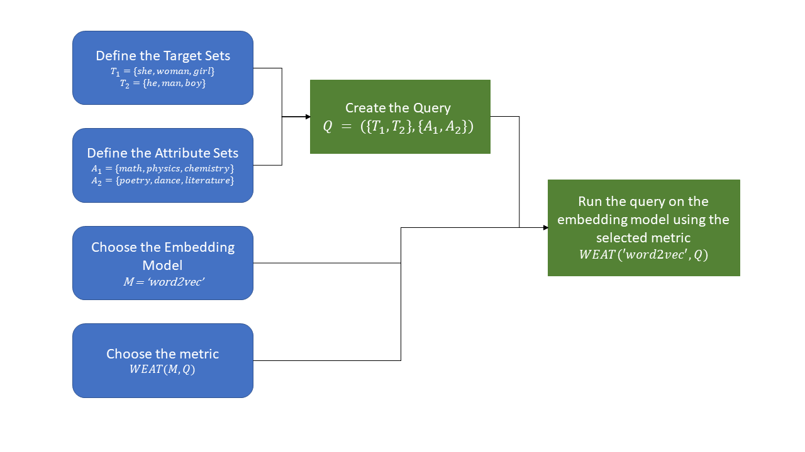

###########
Quick Start
###########

In this tutorial we will show you how to install WEFE and then how to run a 
basic query.

Important: If you are not familiar with the concepts of  query, target and attribute 
set, please visit the `the framework section <index.html#the-framework>`_ 
on the library's index page. 

1. Download and setup
=====================

There are two different ways to install WEFE: 

- To install the package with pip, run in a console::

    pip install wefe

- To install the package with conda, run in a console::

    conda install wefe

2. Run your first Query
=======================

In the following code we will show how to implement the example query presented 
in WEFE's home page: A gender Query using WEAT metrics on the google's 
word2vec Word Embedding model. 

The following graphic shows the flow of the query execution:

The programming of the previous flow can be separated into three steps:

- Load the Word Embedding model. 
- Create the Query. 
- Run the Query using the WEAT metric over the Word Embedding Model.

These stages will be implemented next:

1. Load the Word Embedding pretrained model from :code:`gensim` and then, 
create a :code:`WordEmbeddingModel` instance with it.
This object took a gensim's :code:`KeyedVectors` object and a model name as 
parameters.
As we said previously, for this example, we will use 
:code:`word2vec-google-news-300` model, but in order to speed up the execution 
time, the embedding model could be changed to :code:`glove-twitter-25'`.

>>> # import the modules
>>> from wefe.query import Query
>>> from wefe.word_embedding_model import WordEmbeddingModel
>>> from wefe.metrics.WEAT import WEAT
>>> import gensim.downloader as api
>>>
>>> # load word2vec 
>>> # it can be changed to 'glove-twitter-25' to speed up the loading time.
>>> twitter_25 = api.load('word2vec-google-news-300')
>>> model = WordEmbeddingModel(twitter_25, 'glove twitter dim=25')

2. Create the Query with a loaded, fetched or custom target and attribute 
word sets. In this case, we will manually set both target words and attribute
words.

>>> # create the word sets
>>> target_sets = [['she', 'woman', 'girl'], ['he', 'man', 'boy']]
>>> target_sets_names = ['Female Terms', 'Male Terms']
>>>
>>> attribute_sets = [['math', 'physics', 'chemistry'], ['poetry','dance','literature']]
>>> attribute_sets_names = ['Science', 'Arts']
>>>
>>> # create the query
>>> query = Query(target_sets, attribute_sets, target_sets_names,
>>>               attribute_sets_names)

3. Instance the metric that you will use and then, execute :code:`run_query` 
with the parameters created in the past steps. In this case we will use 
:code:`WEAT`. 

>>> # instance a WEAT metric
>>> weat = WEAT() 
>>> result = weat.run_query(query, model)
>>> print(result)
{'query_name': 'Male Terms and Female Terms wrt Arts and Science',
 'result': -0.010003209}

With this, we close the basic tutorial on the use of the WEFE package. 
For more advanced examples, visit user the `User Guide <user_guide.html>`_ 
section.
