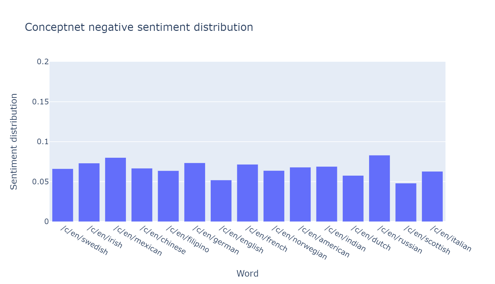
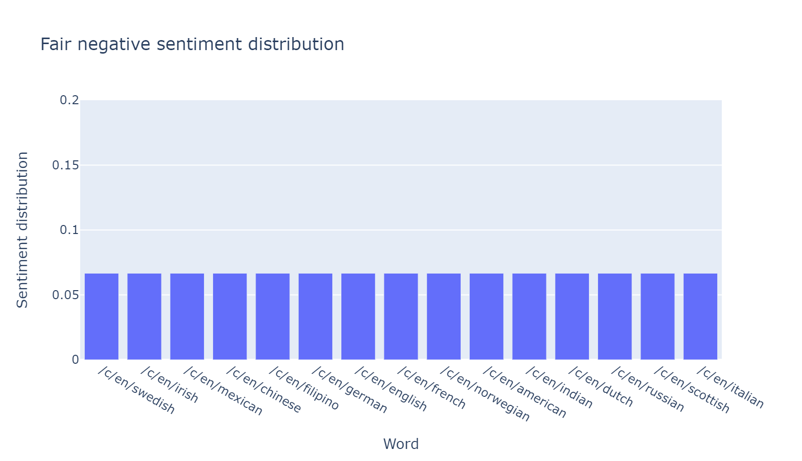

===============================
Replication of Previous Studies
===============================

All replications of other studies that WEFE has currently implemented are in the Examples folder. 

Below we list some examples:

WEAT Replication
================

The following `notebook <https://github.com/dccuchile/wefe/blob/master/examples/WEAT_experiments.ipynb>`__ reproduces the experiments performed in the following paper:

    Semantics derived automatically from language corpora contain human-like biases.
    Aylin Caliskan, Joanna J. Bryson, Arvind Narayanan

.. note:: 

  Due to the formulation of the metric and the methods to transform the word to embeddings, 
  our results are not exactly the same as those reported in 
  the original paper. However, our results are still very similar to those 
  in the original paper.

RNSB Replication
================

The following `notebook <https://github.com/dccuchile/wefe/blob/master/examples/RNSB_experiments.ipynb>`__ replicates the experiments carried out in the following paper:

    Chris Sweeney and Maryam Najafian.
    A transparent framework for evaluating unintended demographic bias in word embeddings.
    In Proceedings of the 57th Annual Meeting of the Association for Computational Linguistics, pages 1662–1667, 2019.

.. note:: 

  Due to the formulation of the metric (it trains a logistic regression in 
  each execution) our results are not exactly the same as those reported in 
  the original paper. However, our results are still very similar to those 
  in the original paper.

>>> from wefe.datasets import load_bingliu
>>> from wefe.metrics import RNSB
>>> from wefe.query import Query
>>> from wefe.word_embedding import 
>>> 
>>> import pandas as pd
>>> import plotly.express as px
>>> import gensim.downloader as api
>>> 
>>> # load the target word sets.
>>> # In this case each word is an objective set because each of them represents a different social group.
>>> RNSB_words = [
>>>     ['swedish'], ['irish'], ['mexican'], ['chinese'], ['filipino'], ['german'], ['english'],
>>>     ['french'], ['norwegian'], ['american'], ['indian'], ['dutch'], ['russian'],
>>>     ['scottish'], ['italian']
>>> ]
>>> 
>>> bing_liu = load_bingliu()
>>> 
>>> # Create the query
>>> query = Query(RNSB_words,
>>>               [bing_liu['positive_words'], bing_liu['negative_words']])
>>> 
>>> # Fetch the models
>>> glove = (api.load('glove-wiki-gigaword-300'),
>>>                            'glove-wiki-gigaword-300')
>>> # note that conceptnet uses a /c/en/ prefix before each word.
>>> conceptnet = (api.load('conceptnet-numberbatch-17-06-300'),
>>>                                 'conceptnet-numberbatch-17',
>>>                                 vocab_prefix='/c/en/')
>>> 
>>> # Run the queries
>>> glove_results = RNSB().run_query(query, glove)
>>> conceptnet_results = RNSB().run_query(query, conceptnet)
>>> 
>>> 
>>> # Show the results obtained with glove
>>> glove_fig = px.bar(
>>>     pd.DataFrame(glove_results['negative_sentiment_distribution'],
>>>                  columns=['Word', 'Sentiment distribution']), x='Word',
>>>     y='Sentiment distribution', title='Glove negative sentiment distribution')
>>> glove_fig.update_yaxes(range=[0, 0.2])
>>> glove_fig.show()

.. image:: images/glove_rnsb.png
  :alt: Glove RNSB sentiment distribution

>>> # Show the results obtained with conceptnet
>>> conceptnet_fig = px.bar(
>>>     pd.DataFrame(conceptnet_results['negative_sentiment_distribution'],
>>>                  columns=['Word', 'Sentiment distribution']), x='Word',
>>>     y='Sentiment distribution',
>>>     title='Conceptnet negative sentiment distribution')
>>> conceptnet_fig.update_yaxes(range=[0, 0.2])
>>> conceptnet_fig.show()

>>> # Finally, we show the fair distribution of sentiments.
>>> fair_distribution = pd.DataFrame(
>>>     conceptnet_results['negative_sentiment_distribution'],
>>>     columns=['Word', 'Sentiment distribution'])
>>> fair_distribution['Sentiment distribution'] = np.ones(
>>>     fair_distribution.shape[0]) / fair_distribution.shape[0]
>>> 
>>> fair_distribution_fig = px.bar(fair_distribution, x='Word',
>>>                                y='Sentiment distribution',
>>>                                title='Fair negative sentiment distribution')
>>> fair_distribution_fig.update_yaxes(range=[0, 0.2])
>>> fair_distribution_fig.show()

.. note::  

  This code is not executed when compiling the documentation due to the long 
  processing time. 
  Instead, the tables and plots of these results were embedded.
  The code is available for execution in the following `notebook <https://github.com/dccuchile/wefe/blob/master/examples/RNSB_experiments.ipynb>`__.