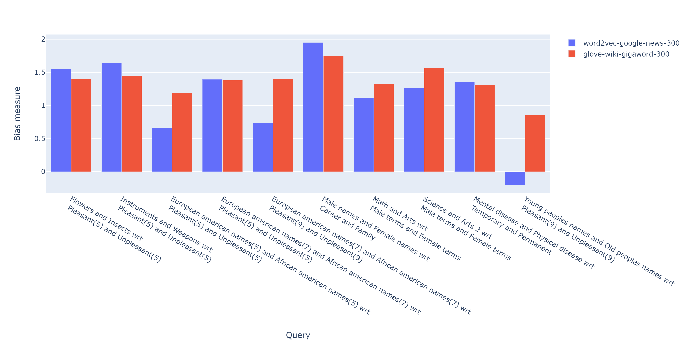

################################
Replication of paper experiments
################################

WEAT Replication
----------------

The following code represents a replica of the experiments performed on the paper:

    Semantics derived automatically from language corpora contain human-like biases.
    Aylin Caliskan, Joanna J. Bryson, Arvind Narayanan

At the end of the code are the results obtained by the execution of the code
Note:
The results do not coincide perfectly because the vocabularies, models and implementation of WEAT used during the development of the paper and now may be different. 
In most cases, however, it can be seen that there is an concordance between the results. 

>>> from wefe.metrics import WEAT
>>> from wefe.datasets import load_weat
>>> from wefe.query import Query
>>> from wefe.word_embedding_model import WordEmbeddingModel
>>> from wefe.utils import run_queries
>>> 
>>> import gensim.downloader as api
>>> 
>>> # Load the wordset
>>> weat_wordset = load_weat()
>>> 
>>> # Define the 10 Queries:
>>> queries = [
>>>     # Flowers vs Insects wrt Pleasant (5) and Unpleasant (5)
>>>     Query([weat_wordset['flowers'], weat_wordset['insects']],
>>>           [weat_wordset['pleasant_5'], weat_wordset['unpleasant_5']],
>>>           ['Flowers', 'Insects'], ['Pleasant(5)', 'Unpleasant(5)']),
>>> 
>>>     # Instruments vs Weapons wrt Pleasant (5) and Unpleasant (5)
>>>     Query([weat_wordset['instruments'], weat_wordset['weapons']],
>>>           [weat_wordset['pleasant_5'], weat_wordset['unpleasant_5']],
>>>           ['Instruments', 'Weapons'], ['Pleasant(5)', 'Unpleasant(5)']),
>>> 
>>>     # European american names(5) vs African american names(5)
>>>     # wrt Pleasant (5) and Unpleasant (5)
>>>     Query([
>>>         weat_wordset['european_american_names_5'],
>>>         weat_wordset['african_american_names_5']
>>>     ], [weat_wordset['pleasant_5'], weat_wordset['unpleasant_5']],
>>>           ['European american names(5)', 'African american names(5)'],
>>>           ['Pleasant(5)', 'Unpleasant(5)']),
>>> 
>>>     # European american names(7) vs African american names(7)
>>>     # wrt Pleasant (5) and Unpleasant (5)
>>>     Query([
>>>         weat_wordset['european_american_names_7'],
>>>         weat_wordset['african_american_names_7']
>>>     ], [weat_wordset['pleasant_5'], weat_wordset['unpleasant_5']],
>>>           ['European american names(7)', 'African american names(7)'],
>>>           ['Pleasant(5)', 'Unpleasant(5)']),
>>> 
>>>     # European american names(7) vs African american names(7)
>>>     # wrt Pleasant (9) and Unpleasant (9)
>>>     Query([
>>>         weat_wordset['european_american_names_7'],
>>>         weat_wordset['african_american_names_7']
>>>     ], [weat_wordset['pleasant_9'], weat_wordset['unpleasant_9']],
>>>           ['European american names(7)', 'African american names(7)'],
>>>           ['Pleasant(9)', 'Unpleasant(9)']),
>>> 
>>>     # Male and female names wrt Career and family
>>>     Query([weat_wordset['male_names'], weat_wordset['female_names']],
>>>           [weat_wordset['career'], weat_wordset['family']],
>>>           ['Male names', 'Female names'], ['Career', 'Family']),
>>> 
>>>     # Math and arts wrt male and female terms
>>>     Query([weat_wordset['math'], weat_wordset['arts']],
>>>           [weat_wordset['male_terms'], weat_wordset['female_terms']],
>>>           ['Math', 'Arts'], ['Male terms', 'Female terms']),
>>> 
>>>     # Science and arts wrt male and female terms
>>>     Query([weat_wordset['science'], weat_wordset['arts_2']],
>>>           [weat_wordset['male_terms'], weat_wordset['female_terms']],
>>>           ['Science', 'Arts 2'], ['Male terms', 'Female terms']),
>>> 
>>>     # Mental and Physical disease wrt Temporary and Permanent
>>>     Query([weat_wordset['mental_disease'], weat_wordset['physical_disease']],
>>>           [weat_wordset['temporary'], weat_wordset['permanent']],
>>>           ['Mental disease', 'Physical disease'], ['Temporary', 'Permanent']),
>>> 
>>>     # Young people names and Old people names disease wrt Pleasant(9) and Unpleasant(9)
>>>     Query(
>>>         [weat_wordset['young_people_names'], weat_wordset['old_people_names']],
>>>         [weat_wordset['pleasant_9'], weat_wordset['unpleasant_9']],
>>>         ['Young peoples names', 'Old peoples names'],
>>>         ['Pleasant(9)', 'Unpleasant(9)'])
>>> ]
>>> 
>>> # Load the embedding models
>>> w2v = WordEmbeddingModel(api.load('word2vec-google-news-300'),
>>>                          'word2vec-google-news-300')
>>> glove = WordEmbeddingModel(api.load('glove-wiki-gigaword-300'),
>>>                            'glove-wiki-gigaword-300')
>>> 
>>> # Execute the queries with the models and WEAT
>>> results = run_queries(WEAT,
>>>                       queries, [w2v, glove],
>>>                       include_average_by_embedding=None,
>>>                       warn_filtered_words=True,
>>>                       metric_params={
>>>                           'return_effect_size': True
>>>                       },
>>>                       lost_vocabulary_threshold=.25)
>>> 
>>> results.T.round(2)

This table shows the output of the execution of the previous code:

+------------------------------------------------------------------------------------------+------------------------+-----------------------+
|                                      Query / Model                                       |word2vec-google-news-300|glove-wiki-gigaword-300|
+==========================================================================================+========================+=======================+
|Flowers and Insects wrt Pleasant(5) and Unpleasant(5)                                     |                    1.55|                   1.40|
+------------------------------------------------------------------------------------------+------------------------+-----------------------+
|Instruments and Weapons wrt Pleasant(5) and Unpleasant(5)                                 |                    1.64|                   1.45|
+------------------------------------------------------------------------------------------+------------------------+-----------------------+
|European american names(5) and African american names(5) wrt Pleasant(5) and Unpleasant(5)|                    0.67|                   1.19|
+------------------------------------------------------------------------------------------+------------------------+-----------------------+
|European american names(7) and African american names(7) wrt Pleasant(5) and Unpleasant(5)|                    1.40|                   1.38|
+------------------------------------------------------------------------------------------+------------------------+-----------------------+
|European american names(7) and African american names(7) wrt Pleasant(9) and Unpleasant(9)|                    0.73|                   1.40|
+------------------------------------------------------------------------------------------+------------------------+-----------------------+
|Male names and Female names wrt Career and Family                                         |                    1.95|                   1.75|
+------------------------------------------------------------------------------------------+------------------------+-----------------------+
|Math and Arts wrt Male terms and Female terms                                             |                    1.12|                   1.33|
+------------------------------------------------------------------------------------------+------------------------+-----------------------+
|Science and Arts 2 wrt Male terms and Female terms                                        |                    1.26|                   1.57|
+------------------------------------------------------------------------------------------+------------------------+-----------------------+
|Mental disease and Physical disease wrt Temporary and Permanent                           |                    1.35|                   1.31|
+------------------------------------------------------------------------------------------+------------------------+-----------------------+
|Young peoples names and Old peoples names wrt Pleasant(9) and Unpleasant(9)               |                   -0.20|                   0.85|
+------------------------------------------------------------------------------------------+------------------------+-----------------------+

The above results in bar chart:

>>> from wefe.utils import plot_queries_results
>>> 
>>> fig = plot_queries_results(results)
>>> fig.show()

Note: This code is not executed when compiling the documentation due to the long processing time taken. 
Instead, the tables and graphs of results were embedded. 
The code is available for execution in this `file <https://github.com/dccuchile/wefe/blob/master/examples/WEAT_experiments.ipynb>`_.

RNSB Replication
----------------

The following code represents a replica of the experiments performed on the paper:

    Chris Sweeney and Maryam Najafian.
    A transparent framework for evaluating unintended demographic bias in word embeddings.
    In Proceedings of the 57th Annual Meeting of the Associationfor Computational Linguistics, pages 1662–1667, 2019.

Note: Due the formulation of the metric (it trains a logistic regression in each execution) we can never get the same results. 
However, those obtained by the code are very similar to those obtained by the paper's makers.

>>> from wefe.datasets import fetch_bingliu
>>> from wefe.metrics import RNSB
>>> from wefe.query import Query
>>> from wefe.word_embedding_model import WordEmbeddingModel
>>> 
>>> import pandas as pd
>>> import plotly.express as px
>>> import gensim.downloader as api
>>> 
>>> # Create and fetch the word sets
>>> RNSB_words = [
>>>     'swedish', 'irish', 'mexican', 'chinese', 'filipino', 'german', 'english',
>>>     'french', 'norwegian', 'american', 'indian', 'dutch', 'russian',
>>>     'scottish', 'italian'
>>> ]
>>> bing_liu = fetch_bingliu()
>>> 
>>> # Create the query
>>> query = Query([RNSB_words],
>>>               [bing_liu['positive_words'], bing_liu['negative_words']],
>>>               ['Ethnicity words'], ['Positive Words', 'Negative Words'])
>>> 
>>> # Fetch the models
>>> glove = WordEmbeddingModel(api.load('glove-wiki-gigaword-300'),
>>>                            'glove-wiki-gigaword-300')
>>> # note that conceptnet uses a /c/en/ prefix before each word.
>>> conceptnet = WordEmbeddingModel(api.load('conceptnet-numberbatch-17-06-300'),
>>>                                 'conceptnet-numberbatch-17',
>>>                                 vocab_prefix='/c/en/')
>>> 
>>> # Run the queries
>>> glove_results = RNSB().run_query(query, glove)
>>> conceptnet_results = RNSB().run_query(query, conceptnet)
>>> 
>>> # Show the results obtained with glove
>>> glove_fig = px.bar(
>>>     pd.DataFrame(glove_results['negative_sentiment_distribution'],
>>>                  columns=['Word', 'Sentiment distribution']), x='Word',
>>>     y='Sentiment distribution', title='Glove negative sentiment distribution')
>>> glove_fig.update_yaxes(range=[0, 0.2])
>>> glove_fig.show()

.. image:: images/glove_rnsb.png
  :alt: Glove RNSB sentiment distribution

>>> # Show the results obtained with conceptnet
>>> conceptnet_fig = px.bar(
>>>     pd.DataFrame(conceptnet_results['negative_sentiment_distribution'],
>>>                  columns=['Word', 'Sentiment distribution']), x='Word',
>>>     y='Sentiment distribution',
>>>     title='Conceptnet negative sentiment distribution')
>>> conceptnet_fig.update_yaxes(range=[0, 0.2])
>>> conceptnet_fig.show()

.. image:: images/conceptnet_rnsb.png
  :alt: Conceptnet RNSB sentiment distribution

>>> # Finally, we show the fair distribution of sentiments.
>>> fair_distribution = pd.DataFrame(
>>>     conceptnet_results['negative_sentiment_distribution'],
>>>     columns=['Word', 'Sentiment distribution'])
>>> fair_distribution['Sentiment distribution'] = np.ones(
>>>     fair_distribution.shape[0]) / fair_distribution.shape[0]
>>> 
>>> fair_distribution_fig = px.bar(fair_distribution, x='Word',
>>>                                y='Sentiment distribution',
>>>                                title='Fair negative sentiment distribution')
>>> fair_distribution_fig.update_yaxes(range=[0, 0.2])
>>> fair_distribution_fig.show()

.. image:: images/fair_rnsb.png
  :alt: Fair RNSB sentiment distribution

Note: This code is not executed when compiling the documentation due to the long processing time taken. 
Instead, the tables and graphs of results were embedded. 
The code is available for execution in `file <https://github.com/dccuchile/wefe/blob/master/examples/RNSB_experiments.ipynb>`_.
