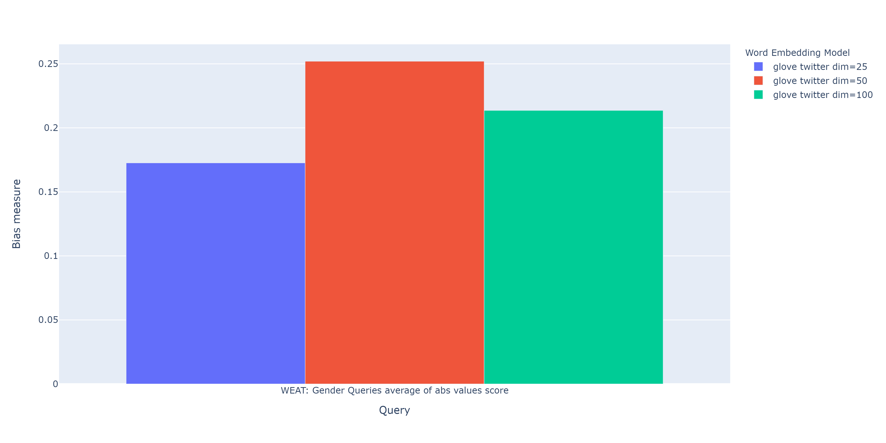
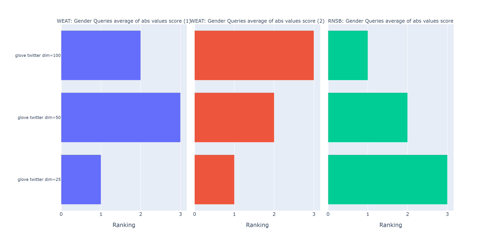
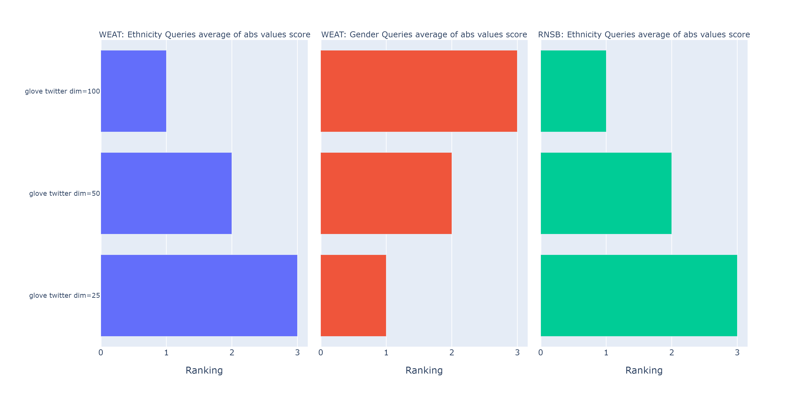
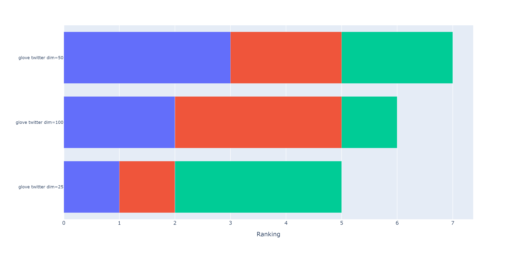
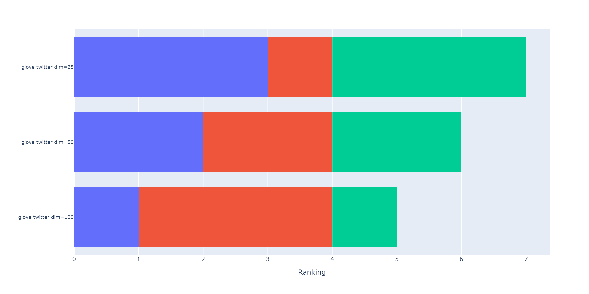

WEFE User guide
===============

The following guide is designed to present the more general details on
using the package. This guide is divided into two sections:

The first section explains how bias measurements are performed in WEFE:

-  We present how to run a simple query using ``Glove`` embedding model.
-  We show how to run multiple queries on multiple embeddings.
-  We show how to compare the results obtained from running multiple
   sets of queries on multiple embeddings using different metrics
   through ranking calculation.
-  Finally, we show how to calculate the correlations between the
   rankings obtained.

The second section explains how the bias mitigation is performed in
WEFE.

-  We present how to reduce binary bias (such as gender bias) using Hard
   Debias.
-  We present how to reduce multiclass bias (such as ethnic having
   classes like black, white, Latino, etc…) using Multiclass Hard
   Debias.


.. warning::

    To accurately study and reduce biases contained in word embeddings, queries may
    contain words that could be offensive to certain groups or individuals.
    The relationships studied between these words DO NOT represent the
    ideas, thoughts or beliefs of the authors of this library. This applies
    to this and all pages of the documentation.


.. note::

  If you are not familiar with the concepts of query, target and attribute
  set, please visit the `the framework
  section <https://wefe.readthedocs.io/en/latest/about.html#the-framework>`__
  on the library’s about page. These concepts will be widely used in the
  following sections.

A jupyter notebook with this code is located in the following link: `WEFE User
Guide <https://github.com/dccuchile/wefe/blob/master/examples/User_Guide.ipynb>`__.


--------------


Bias Measurement
----------------

Run a Query
~~~~~~~~~~~

The following subsections explains how to run a simple query that
measures gender bias on
`Glove <https://nlp.stanford.edu/projects/glove/>`__. The example uses
the Word Embedding Association Test (``WEAT``) metric quantifying the
bias in the embeddings model. Below we show the three usual steps for
performing a query in ``WEFE``:

.. note::

  ``WEAT`` is a fairness metric that quantifies the relationship between
  two sets of target words (sets of words intended to denote a social
  groups as men and women) and two sets of attribute words (sets of words
  representing some attitude, characteristic, trait, occupational field,
  etc. that can be associated with individuals from any social group). The
  closer its value is to 0, the less biased the model is. WEAT was
  originally implemented in *Semantics derived automatically from language
  corpora contain human-like biases* paper.

Load a word embeddings model as a ``WordEmbedding`` object.
~~~~~~~~~~~~~~~~~~~~~~~~~~~~~~~~~~~~~~~~~~~~~~~~~~~~~~~~~~~

Load the word embedding model and then wrap it using a
``WordEmbeddingModel`` (class that allows WEFE to handle the models).

WEFE bases all its operations on word embeddings using Gensim’s
``KeyedVectors`` interface. Any model that can be loaded using
``KeyedVectors`` will be compatible with WEFE.

The following example uses a 25-dim pre-trained ``Glove`` model using a
twitter dataset loaded using
```gensim-data`` <https://github.com/RaRe-Technologies/gensim-data>`__.

.. code:: ipython3

    import gensim.downloader as api
    
    from wefe.datasets import load_weat
    from wefe.metrics import WEAT
    from wefe.query import Query
    from wefe.word_embedding_model import WordEmbeddingModel
    
    twitter_25 = api.load("glove-twitter-25")
    # WordEmbeddingModel receives as first argument a KeyedVectors model
    # and the second argument the model name.
    model = WordEmbeddingModel(twitter_25, "glove twitter dim=25")


Create the query using a ``Query`` object
~~~~~~~~~~~~~~~~~~~~~~~~~~~~~~~~~~~~~~~~~

Define the target and attribute words sets and create a Query object
that contains them.

For this initial example, a query is used to study the association
between gender with respect to family and career. The words used are
taken from the set of words used in the *Semantics derived automatically
from language corpora contain human-like biases* paper, which are
included in the ``datasets`` module.

.. code:: ipython3

    gender_query = Query(
        target_sets=[
            ["female", "woman", "girl", "sister", "she", "her", "hers", "daughter"],
            ["male", "man", "boy", "brother", "he", "him", "his", "son"],
        ],
        attribute_sets=[
            [
                "home",
                "parents",
                "children",
                "family",
                "cousins",
                "marriage",
                "wedding",
                "relatives",
            ],
            [
                "executive",
                "management",
                "professional",
                "corporation",
                "salary",
                "office",
                "business",
                "career",
            ],
        ],
        target_sets_names=["Female terms", "Male Terms"],
        attribute_sets_names=["Family", "Careers"],
    )
    
    print(gender_query)


.. parsed-literal::

    <Query: Female terms and Male Terms wrt Family and Careers
    - Target sets: [['home', 'parents', 'children', 'family', 'cousins', 'marriage', 'wedding', 'relatives'], ['executive', 'management', 'professional', 'corporation', 'salary', 'office', 'business', 'career']]
    - Attribute sets:[['female', 'woman', 'girl', 'sister', 'she', 'her', 'hers', 'daughter'], ['male', 'man', 'boy', 'brother', 'he', 'him', 'his', 'son']]>


Run the Query
~~~~~~~~~~~~~

Instantiate the metric that you will use and then execute ``run_query``
with the parameters created in the previous steps.

Any bias measurement process at WEFE consists of the following steps:

1. Metric arguments checking.
2. Transform the word sets into word embeddings.
3. Calculate the metric.

In this case we are going to use the ``WEAT`` metric (proposed in the
same paper of the set of words used in the query).

.. code:: ipython3

    metric = WEAT()
    result = metric.run_query(gender_query, model)
    print(result)


.. parsed-literal::

    {'query_name': 'Female terms and Male Terms wrt Family and Careers', 'result': 0.3165843551978469, 'weat': 0.3165843551978469, 'effect_size': 0.6779444653930398, 'p_value': nan}


By default, the results are a ``dict`` containing the query name (in the
key ``query_name``) and the calculated value of the metric in the
``result`` key. It also contains a key with the name and the value of
the calculated metric (which is duplicated in the “results” key).

Depending on the metric class used, the result ``dict`` can also return
more metrics, detailed word-by-word values or other statistics like
p-values. Also some metrics allow you to change the default value in
results, which will have implications a little further down the line.

Details of all the metrics implemented, their references, parameters and
examples of execution can be found at `API
documentation <https://wefe.readthedocs.io/en/latest/api.html>`__.
          
Metric Params
~~~~~~~~~~~~~

Each metric allows to vary the behavior of ``run_query`` according to
different parameters. For example: there are parameters to change the
preprocessing of the words, others to warn errors or to modify what the
method returns by default.

The parameters of each metric are detailed in the `API
documentation <https://wefe.readthedocs.io/en/latest/api.html>`__.

In this case, if we want ``run_query`` returns ``effect_size`` instead
of ``weat`` in the result , when we execute ``run_query`` we can pass
the parameter ``return_effect_size`` equal to ``True``. Note that this
parameter is only of the class ``WEAT``.

.. code:: ipython3

    weat = WEAT()
    result = weat.run_query(gender_query, model, return_effect_size = True)
    print(result)


.. code:: ipython3

    {'query_name': 'Male terms and Female terms wrt Career and Family', 
     'result': 0.677944, 
     'weat': 0.3165841, 
     'effect_size': 0.677944, 
     'p-value': None}
    

Word preprocessors
~~~~~~~~~~~~~~~~~~

There may be word embeddings models whose words are not cased or that do
not have accents. In ``Glove``, for example, all its words in its
vocabulary are lowercase. However, many words in WEAT’s ethnicity
dataset contain cased words.

.. code:: ipython3

    print(word_sets['european_american_names_5'])


.. parsed-literal::

    ['Adam', 'Harry', 'Josh', 'Roger', 'Alan', 'Frank', 'Justin', 'Ryan', 'Andrew', 'Jack', 'Matthew', 'Stephen', 'Brad', 'Greg', 'Paul', 'Jonathan', 'Peter', 'Amanda', 'Courtney', 'Heather', 'Melanie', 'Sara', 'Amber', 'Katie', 'Betsy', 'Kristin', 'Nancy', 'Stephanie', 'Ellen', 'Lauren', 'Colleen', 'Emily', 'Megan', 'Rachel']
    

If we carelessly execute the following query, when transforming word
sets to embeddings we could lose many words or the whole of several
sets.

You can specify that ``run_query`` log the words that were lost in the
transformation to vectors by using the parameter
``warn_not_found_words=True``.

.. code:: ipython3

    ethnicity_query = Query(
        [
            word_sets['european_american_names_5'],
            word_sets['african_american_names_5']
        ], [word_sets['pleasant_5'], word_sets['unpleasant_5']],
        ['European american names(5)', 'African american names(5)'],
        ['Pleasant(5)', 'Unpleasant(5)'])
    
    result = weat.run_query(ethnicity_query,
                            model, 
                            warn_not_found_words=True)
    print(result)


.. parsed-literal::

    WARNING:root:The following words from set 'European american names(5)' do not exist within the vocabulary of glove twitter dim=25: ['Adam', 'Harry', 'Josh', 'Roger', 'Alan', 'Frank', 'Justin', 'Ryan', 'Andrew', 'Jack', 'Matthew', 'Stephen', 'Brad', 'Greg', 'Paul', 'Jonathan', 'Peter', 'Amanda', 'Courtney', 'Heather', 'Melanie', 'Sara', 'Amber', 'Katie', 'Betsy', 'Kristin', 'Nancy', 'Stephanie', 'Ellen', 'Lauren', 'Colleen', 'Emily', 'Megan', 'Rachel']
    WARNING:root:The transformation of 'European american names(5)' into glove twitter dim=25 embeddings lost proportionally more words than specified in 'lost_words_threshold': 1.0 lost with respect to 0.2 maximum loss allowed.
    WARNING:root:The following words from set 'African american names(5)' do not exist within the vocabulary of glove twitter dim=25: ['Alonzo', 'Jamel', 'Theo', 'Alphonse', 'Jerome', 'Leroy', 'Torrance', 'Darnell', 'Lamar', 'Lionel', 'Tyree', 'Deion', 'Lamont', 'Malik', 'Terrence', 'Tyrone', 'Lavon', 'Marcellus', 'Wardell', 'Nichelle', 'Shereen', 'Ebony', 'Latisha', 'Shaniqua', 'Jasmine', 'Tanisha', 'Tia', 'Lakisha', 'Latoya', 'Yolanda', 'Malika', 'Yvette']
    WARNING:root:The transformation of 'African american names(5)' into glove twitter dim=25 embeddings lost proportionally more words than specified in 'lost_words_threshold': 1.0 lost with respect to 0.2 maximum loss allowed.
    ERROR:root:At least one set of 'European american names(5) and African american names(5) wrt Pleasant(5) and Unpleasant(5)' query has proportionally fewer embeddings than allowed by the lost_vocabulary_threshold parameter (0.2). This query will return np.nan.
    

.. parsed-literal::

    {'query_name': 'European american names(5) and African american names(5) wrt Pleasant(5) and Unpleasant(5)', 'result': nan, 'weat': nan, 'effect_size': nan}
    

**Warning**

In order to give more robustness to the results, if more than 20% (by
default) of the words from any of the word sets of the query are not
included in the word embedding model, the result of the metric will be
``np.nan``. This behavior can be changed using a float number parameter
called ``lost_vocabulary_threshold``.

One of the parameters of ``run_query``, ``preprocessor_args`` allows to
run a preprocessor to each word of all sets before getting its vectors.
This preprocessor can specify that words be preprocessed to lowercase,
remove accents or any other custom preprocessing given by the user.

The possible options for ``preprocessor_args`` are:

-  ``lowercase``: ``bool``. Indicates if the words are transformed to
   lowercase.
-  ``strip_accents``: ``bool, {'ascii', 'unicode'}``: Specifies if the
   accents of the words are eliminated. The stripping type can be
   specified. ``True`` uses ``'unicode'`` by default.
-  ``preprocessor``: ``Callable``. It receives a function that operates
   on each word. In the case of specifying a function, it overrides the
   default preprocessor (i.e., the previous options stop working).

.. code:: ipython3

    weat = WEAT()
    result = weat.run_query(ethnicity_query,
                            model,
                            preprocessor_args={
                                'lowercase': True,
                                'strip_accents': True
                            })
    print(result)


.. parsed-literal::

    {'query_name': 'European american names(5) and African american names(5) wrt Pleasant(5) and Unpleasant(5)', 'result': 3.7529151, 'weat': 3.7529151, 'effect_size': 1.2746819, 'p-value': None}
    

It may happen that first you want to try to find the vector of a word in
uppercase, (since this vector may contain more information than the one
of the word lowercased) and if it is not exists in the model, then try
to find its lowercase representation. This behavior can be specified by
specifying preprocessing options in ``secondary_preprocessor_args`` and
leaving the primary by default (i,e,. without providing it).

In general, the search for vectors will be done first by using the
preprocessor specified in ``preprocessor_args`` and then the specified
in ``secondary_preprocessor_args`` if this was provided. Therefore, any
combination of these is also supported.

.. code:: ipython3

    weat = WEAT()
    result = weat.run_query(ethnicity_query,
                            model,
                            secondary_preprocessor_args={
                                'lowercase': True,
                                'strip_accents': True
                            })
    print(result)


.. code:: python

    {'query_name': 'European american names(5) and African american names(5) wrt Pleasant(5) and Unpleasant(5)', 
     'result': 3.7529151, 
     'weat': 3.7529151, 
     'effect_size': 1.2746819, 
     'p-value': None}
    

Running multiple Queries
------------------------

We usually want to test several queries that study some criterion of
bias: gender, ethnicity, religion, politics, socioeconomic, among
others. Let’s suppose you’ve created 20 queries that study gender bias
on different models of embeddings. Trying to use ``run_query`` on each
pair embedding-query can be a bit complex and will require extra work to
implement.

This is why the library also implements a function to test multiple
queries on various word embedding models in a single call: the
``run_queries`` util.

The following code shows how to run various gender queries on ``Glove``
embedding models with different dimensions trained from the Twitter
dataset. The queries will be executed using ``WEAT`` metric.

.. code:: ipython3

    from wefe.query import Query
    from wefe.word_embedding_model import WordEmbeddingModel
    from wefe.metrics import WEAT, RNSB
    
    from wefe.datasets import load_weat
    from wefe.utils import run_queries
    
    import gensim.downloader as api

Load the models:
~~~~~~~~~~~~~~~~

Load three different Glove Twitter embedding models. These models were
trained using the same dataset varying the number of embedding
dimensions.

.. code:: ipython3

    model_1 = WordEmbeddingModel(api.load('glove-twitter-25'),
                                 'glove twitter dim=25')
    model_2 = WordEmbeddingModel(api.load('glove-twitter-50'),
                                 'glove twitter dim=50')
    model_3 = WordEmbeddingModel(api.load('glove-twitter-100'),
                                 'glove twitter dim=100')
    
    models = [model_1, model_2, model_3]


Load the word sets and create the queries
~~~~~~~~~~~~~~~~~~~~~~~~~~~~~~~~~~~~~~~~~

Now, we will load the ``WEAT`` word set and create three queries. The
three queries are intended to measure gender bias.

.. code:: ipython3

    # Load the WEAT word sets
    word_sets = load_weat()
    
    # Create gender queries
    gender_query_1 = Query([word_sets['male_terms'], word_sets['female_terms']],
                           [word_sets['career'], word_sets['family']],
                           ['Male terms', 'Female terms'], ['Career', 'Family'])
    
    gender_query_2 = Query([word_sets['male_terms'], word_sets['female_terms']],
                           [word_sets['science'], word_sets['arts']],
                           ['Male terms', 'Female terms'], ['Science', 'Arts'])
    
    gender_query_3 = Query([word_sets['male_terms'], word_sets['female_terms']],
                           [word_sets['math'], word_sets['arts_2']],
                           ['Male terms', 'Female terms'], ['Math', 'Arts'])
    
    gender_queries = [gender_query_1, gender_query_2, gender_query_3]

Run the queries on all Word Embeddings using WEAT.
~~~~~~~~~~~~~~~~~~~~~~~~~~~~~~~~~~~~~~~~~~~~~~~~~~

Now, to run our list of queries and models, we call ``run_queries``
using the parameters defined in the previous step. The mandatory
parameters of the function are 3:

-  a metric,
-  a list of queries, and,
-  a list of embedding models.

It is also possible to provide a name for the criterion studied in this
set of queries through the parameter ``queries_set_name``.

.. code:: ipython3

    # Run the queries
    WEAT_gender_results = run_queries(WEAT,
                                      gender_queries,
                                      models,
                                      queries_set_name='Gender Queries')
    WEAT_gender_results


.. parsed-literal::

    WARNING:root:The transformation of 'Science' into glove twitter dim=25 embeddings lost proportionally more words than specified in 'lost_words_threshold': 0.25 lost with respect to 0.2 maximum loss allowed.
    ERROR:root:At least one set of 'Male terms and Female terms wrt Science and Arts' query has proportionally fewer embeddings than allowed by the lost_vocabulary_threshold parameter (0.2). This query will return np.nan.
    WARNING:root:The transformation of 'Science' into glove twitter dim=50 embeddings lost proportionally more words than specified in 'lost_words_threshold': 0.25 lost with respect to 0.2 maximum loss allowed.
    ERROR:root:At least one set of 'Male terms and Female terms wrt Science and Arts' query has proportionally fewer embeddings than allowed by the lost_vocabulary_threshold parameter (0.2). This query will return np.nan.
    WARNING:root:The transformation of 'Science' into glove twitter dim=100 embeddings lost proportionally more words than specified in 'lost_words_threshold': 0.25 lost with respect to 0.2 maximum loss allowed.
    ERROR:root:At least one set of 'Male terms and Female terms wrt Science and Arts' query has proportionally fewer embeddings than allowed by the lost_vocabulary_threshold parameter (0.2). This query will return np.nan.


=====================  ===================================================  ==================================================  ===============================================
model_name               Male terms and Female terms wrt Career and Family    Male terms and Female terms wrt Science and Arts    Male terms and Female terms wrt Math and Arts
=====================  ===================================================  ==================================================  ===============================================
glove twitter dim=25                                              0.316584                                                 nan                                       -0.0221328
glove twitter dim=50                                              0.363743                                                 nan                                       -0.272334
glove twitter dim=100                                             0.385352                                                 nan                                       -0.0825434
=====================  ===================================================  ==================================================  ===============================================

.. warning::

  If more than 20% (by default) of the words from any of the word 
  sets of the query are not included in the word embedding model, the metric 
  will return :code:`Nan`.
  This behavior can be changed using a float number parameter called 
  :code:`lost_vocabulary_threshold`. 


Setting metric params
~~~~~~~~~~~~~~~~~~~~~

As you can see from the results above, there is a whole column that has
no results. As the warnings point out, when transforming the words of
the sets into embeddings, there is a loss of words that is greater than
the allowed by the parameter ``lost_vocabulary_threshold``. Therefore,
all those queries return ``np.nan``. In this case, it would be very
useful to use the word preprocessors seen above.

When we use ``run_queries``, we can also provide specific parameters for
each metric. We can do this by passing a ``dict`` with the metric params
to the ``metric_params`` parameter. In this case, we will use
``preprocessor_args`` to lower the words.

.. code:: ipython3

    WEAT_gender_results = run_queries(
        WEAT,
        gender_queries,
        models,
        metric_params={'preprocessor_args': {
            'lowercase': True
        }},
        queries_set_name='Gender Queries')
    
    WEAT_gender_results

=====================  ===================================================  ==================================================  ===============================================
model_name               Male terms and Female terms wrt Career and Family    Male terms and Female terms wrt Science and Arts    Male terms and Female terms wrt Math and Arts
=====================  ===================================================  ==================================================  ===============================================
glove twitter dim=25                                              0.316584                                           0.167431                                        -0.0339119
glove twitter dim=50                                              0.363743                                          -0.0846904                                       -0.307589
glove twitter dim=100                                             0.385352                                           0.0996324                                       -0.15579
=====================  ===================================================  ==================================================  ===============================================

As you can see from the results table, no query was lost now.

Plot the results in a barplot
~~~~~~~~~~~~~~~~~~~~~~~~~~~~~

The library also provides an easy way to plot the results obtained from
a ``run_queries`` execution into a ``plotly`` braplot.

.. code:: ipython3

    from wefe.utils import run_queries, plot_queries_results
    
    # Plot the results
    plot_queries_results(WEAT_gender_results).show()


.. image:: images/WEAT_gender_results.png
  :alt: WEAT gender results


Aggregating Results
~~~~~~~~~~~~~~~~~~~

The execution of ``run_queries`` in the previous step gave us many
results evaluating the gender bias in the tested embeddings. However,
these do not tell us much about the overall fairness of the embedding
models with respect to the criteria evaluated. Therefore, we would like
to have some mechanism that allows us to aggregate the results directly
obtained in ``run_query`` so that we can evaluate the bias as a whole.

A simple way to aggregate the results would be to average their absolute
values. For this, when using ``run_queries``, you must set the
``aggregate_results`` parameter as ``True``. This default value will
activate the option to aggregate the results by averaging the absolute
values of the results and put them in the last column.

This aggregation function can be modified through the
aggregation_function parameter. Here you can specify a string that
defines some of the aggregation types that are already implemented, as
well as provide a function that operates in the results dataframe.

The aggregation functions available are:

-  Average ``avg``.
-  Average of the absolute values ``abs_avg``.
-  Sum ``sum``.
-  Sum of the absolute values, ``abs_sum``.

.. note::

  Notice that some functions are more appropriate for certain metrics. For
  metrics returning only positive numbers, all the previous aggregation
  functions would be OK. In contrast, for metrics returning real values
  (e.g., ``WEAT``, ``RND``, etc…), aggregation functions such as sum would
  make different outputs to cancel each other.

Let’s aggregate the results from previous example by the average of the
absolute values:

.. code:: ipython3

    WEAT_gender_results_agg = run_queries(
        WEAT,
        gender_queries,
        models,
        metric_params={'preprocessor_args': {
            'lowercase': True
        }},
        aggregate_results=True,
        aggregation_function='abs_avg',
        queries_set_name='Gender Queries')
    WEAT_gender_results_agg


=====================  ===================================================  ==================================================  ===============================================  ==================================================
model_name               Male terms and Female terms wrt Career and Family    Male terms and Female terms wrt Science and Arts    Male terms and Female terms wrt Math and Arts    WEAT: Gender Queries average of abs values score
=====================  ===================================================  ==================================================  ===============================================  ==================================================
glove twitter dim=25                                              0.316584                                           0.167431                                        -0.0339119                                            0.172642
glove twitter dim=50                                              0.363743                                          -0.0846904                                       -0.307589                                             0.252008
glove twitter dim=100                                             0.385352                                           0.0996324                                       -0.15579                                              0.213591
=====================  ===================================================  ==================================================  ===============================================  ==================================================

.. code:: ipython3

    plot_queries_results(WEAT_gender_results_agg).show()


.. image:: images/WEAT_gender_results_agg.png
  :alt: WEAT aggregated gender results

Finally, we can ask the function to return only the aggregated values
(through ``return_only_aggregation`` parameter) and then plot them.

.. code:: ipython3

    WEAT_gender_results_only_agg = run_queries(
        WEAT,
        gender_queries,
        models,
        metric_params={'preprocessor_args': {
            'lowercase': True
        }},
        aggregate_results=True,
        aggregation_function='abs_avg',
        return_only_aggregation=True,
        queries_set_name='Gender Queries')
    WEAT_gender_results_only_agg


=====================  ==================================================
model_name               WEAT: Gender Queries average of abs values score
=====================  ==================================================
glove twitter dim=25                                             0.172642
glove twitter dim=50                                             0.252008
glove twitter dim=100                                            0.213591
=====================  ==================================================

.. code:: ipython3

    plot_queries_results(WEAT_gender_results_only_agg).show()




Calculate Rankings
------------------

When we want to measure various criteria of bias in different embedding
models, two major problems arise:

1. One type of bias can dominate the other because of significant
   differences in magnitude.

2. Different metrics can operate on different scales, which makes them
   difficult to compare.

To show that, suppose we have two sets of queries: one that explores
gender biases and another that explores ethnicity biases, and we want to
test these sets of queries on 3 Twitter Glove models of 25, 50 and 100
dimensions each, using both WEAT and Relative Negative Sentiment Bias
(RNSB) as bias metrics.

1. Let’s show the first problem: the bias scores obtained from one set
   of queries are much higher than those from the other set, even when
   the same metric is used.

We executed the gender and ethnicity queries using WEAT and the 3 models
mentioned above. The results obtained are:

=====================  ==================================================  =====================================================
model_name               WEAT: Gender Queries average of abs values score    WEAT: Ethnicity Queries average of abs values score
=====================  ==================================================  =====================================================
glove twitter dim=25                                             0.210556                                                2.64632
glove twitter dim=50                                             0.292373                                                1.87431
glove twitter dim=100                                            0.225116                                                1.78469
=====================  ==================================================  =====================================================

As can be seen, the results of ethnicity bias are much greater than
those of gender.

2. For the second problem: Metrics deliver their results on different
   scales.

We executed the gender queries using WEAT and RNSB metrics and the 3
models mentioned above. The results obtained are:

=====================  ==================================================  ==================================================
model_name               WEAT: Gender Queries average of abs values score    RNSB: Gender Queries average of abs values score
=====================  ==================================================  ==================================================
glove twitter dim=25                                             0.210556                                           0.032673
glove twitter dim=50                                             0.292373                                           0.049429
glove twitter dim=100                                            0.225116                                           0.0312772
=====================  ==================================================  ==================================================

We can see differences between the results of both metrics of an order
of magnitude.

To address these two problems, we propose to create rankings. Rankings
allow us to focus on the relative differences reported by the metrics
(for different models) instead of focusing on the absolute values.

Now, let’s create rankings using the data used above. The following code
will load the models and create the queries:

.. code:: ipython3

    from wefe.query import Query
    from wefe.datasets.datasets import load_weat
    from wefe.word_embedding_model import WordEmbeddingModel
    from wefe.metrics import WEAT, RNSB
    from wefe.utils import run_queries, create_ranking, plot_ranking, plot_ranking_correlations
    
    import gensim.downloader as api
    
    # Load the models
    model_1 = WordEmbeddingModel(api.load('glove-twitter-25'),
                                 'glove twitter dim=25')
    model_2 = WordEmbeddingModel(api.load('glove-twitter-50'),
                                 'glove twitter dim=50')
    model_3 = WordEmbeddingModel(api.load('glove-twitter-100'),
                                 'glove twitter dim=100')
    
    models = [model_1, model_2, model_3]
    
    # Load the WEAT word sets
    word_sets = load_weat()
    
    # Create gender queries
    gender_query_1 = Query([word_sets['male_terms'], word_sets['female_terms']],
                           [word_sets['career'], word_sets['family']],
                           ['Male terms', 'Female terms'], ['Career', 'Family'])
    gender_query_2 = Query([word_sets['male_terms'], word_sets['female_terms']],
                           [word_sets['science'], word_sets['arts']],
                           ['Male terms', 'Female terms'], ['Science', 'Arts'])
    gender_query_3 = Query([word_sets['male_terms'], word_sets['female_terms']],
                           [word_sets['math'], word_sets['arts_2']],
                           ['Male terms', 'Female terms'], ['Math', 'Arts'])
    
    # Create ethnicity queries
    ethnicity_query_1 = Query([word_sets['european_american_names_5'],
                               word_sets['african_american_names_5']],
                              [word_sets['pleasant_5'], word_sets['unpleasant_5']],
                              ['European Names', 'African Names'],
                              ['Pleasant', 'Unpleasant'])
    
    ethnicity_query_2 = Query([word_sets['european_american_names_7'],
                               word_sets['african_american_names_7']],
                              [word_sets['pleasant_9'], word_sets['unpleasant_9']],
                              ['European Names', 'African Names'],
                              ['Pleasant 2', 'Unpleasant 2'])
    
    gender_queries = [gender_query_1, gender_query_2, gender_query_3]
    ethnicity_queries = [ethnicity_query_1, ethnicity_query_2]


Now, we will run the queries with ``WEAT``, ``WEAT Effect Size`` and
``RNSB``:

.. code:: ipython3

    # Run the queries WEAT
    WEAT_gender_results = run_queries(
        WEAT,
        gender_queries,
        models,
        metric_params={'preprocessor_args': {
            'lowercase': True
        }},
        aggregate_results=True,
        return_only_aggregation=True,
        queries_set_name='Gender Queries')
    
    WEAT_ethnicity_results = run_queries(
        WEAT,
        ethnicity_queries,
        models,
        metric_params={'preprocessor_args': {
            'lowercase': True
        }},
        aggregate_results=True,
        return_only_aggregation=True,
        queries_set_name='Ethnicity Queries')

    # Run the queries with WEAT Effect Size
    
    WEAT_EZ_gender_results = run_queries(WEAT,
                                         gender_queries,
                                         models,
                                         metric_params={
                                             'preprocessor_args': {
                                                 'lowercase': True
                                             },
                                             'return_effect_size': True
                                         },
                                         aggregate_results=True,
                                         return_only_aggregation=True,
                                         queries_set_name='Gender Queries')
    
    WEAT_EZ_ethnicity_results = run_queries(WEAT,
                                         ethnicity_queries,
                                         models,
                                         metric_params={
                                             'preprocessor_args': {
                                                 'lowercase': True
                                             },
                                             'return_effect_size': True
                                         },
                                         aggregate_results=True,
                                         return_only_aggregation=True,
                                         queries_set_name='Ethnicity Queries')

    # Run the queries using RNSB
    RNSB_gender_results = run_queries(
        RNSB,
        gender_queries,
        models,
        metric_params={'preprocessor_args': {
            'lowercase': True
        }},
        aggregate_results=True,
        return_only_aggregation=True,
        queries_set_name='Gender Queries')
    
    RNSB_ethnicity_results = run_queries(
        RNSB,
        ethnicity_queries,
        models,
        metric_params={'preprocessor_args': {
            'lowercase': True
        }},
        aggregate_results=True,
        return_only_aggregation=True,
        queries_set_name='Ethnicity Queries')


   
To create the ranking we’ll use the ``create_ranking`` function. This
function takes all the DataFrames containing the calculated scores and
uses the last column to create the ranking. It assumes that there is an
aggregation in this column.

.. code:: ipython3

    from wefe.utils import run_queries, create_ranking, plot_ranking, plot_ranking_correlations
    
    
    gender_ranking = create_ranking([
        WEAT_gender_results, WEAT_EZ_gender_results, RNSB_gender_results
    ])
    
    gender_ranking

=====================  ======================================================  ======================================================  ==================================================
model_name               WEAT: Gender Queries average of abs values score (1)    WEAT: Gender Queries average of abs values score (2)    RNSB: Gender Queries average of abs values score
=====================  ======================================================  ======================================================  ==================================================
glove twitter dim=25                                                        1                                                       1                                                   3
glove twitter dim=50                                                        3                                                       2                                                   2
glove twitter dim=100                                                       2                                                       3                                                   1
=====================  ======================================================  ======================================================  ==================================================

.. code:: ipython3

    ethnicity_ranking = create_ranking([
        WEAT_ethnicity_results, WEAT_EZ_gender_results, RNSB_ethnicity_results
    ])
    
    ethnicity_ranking

=====================  =====================================================  ==================================================  =====================================================
model_name               WEAT: Ethnicity Queries average of abs values score    WEAT: Gender Queries average of abs values score    RNSB: Ethnicity Queries average of abs values score
=====================  =====================================================  ==================================================  =====================================================
glove twitter dim=25                                                       3                                                   1                                                      3
glove twitter dim=50                                                       2                                                   2                                                      2
glove twitter dim=100                                                      1                                                   3                                                      1
=====================  =====================================================  ==================================================  =====================================================


Plotting the rankings
~~~~~~~~~~~~~~~~~~~~~

Finally, we can plot the rankings in barplots using the ``plot_ranking``
function. The function can be used in two ways:

**With facet by Metric and Criteria:**

This image shows the rankings separated by each bias criteria and metric
(i.e, by each column). Each bar represents the position of the embedding
in the corresponding criterion-metric ranking.

.. code:: ipython3

    plot_ranking(gender_ranking, use_metric_as_facet=True)




.. code:: ipython3

    plot_ranking(ethnicity_ranking, use_metric_as_facet=True)




**Without facet**

This image shows the accumulated rankings for each embedding model. Each
bar represents the sum of the rankings obtained by each embedding. Each
color within a bar represents a different criterion-metric ranking.

.. code:: ipython3

    plot_ranking(gender_ranking)



.. code:: ipython3

    plot_ranking(ethnicity_ranking)



Ranking Correlations
--------------------

We can see how the rankings obtained in the previous section relate to
each other by using a correlation matrix. To do this we provide a
function called ``calculate_ranking_correlations``. This function takes
the rankings as input and calculates the Spearman correlation between
them.

.. code:: ipython3

    from wefe.utils import calculate_ranking_correlations, plot_ranking_correlations
    correlations = calculate_ranking_correlations(gender_ranking)
    correlations

====================================================  ======================================================  ======================================================  ==================================================
Model                                                   WEAT: Gender Queries average of abs values score (1)    WEAT: Gender Queries average of abs values score (2)    RNSB: Gender Queries average of abs values score
====================================================  ======================================================  ======================================================  ==================================================
WEAT: Gender Queries average of abs values score (1)                                                     1                                                       0.5                                                -0.5
WEAT: Gender Queries average of abs values score (2)                                                     0.5                                                     1                                                  -1
RNSB: Gender Queries average of abs values score                                                        -0.5                                                    -1                                                   1
====================================================  ======================================================  ======================================================  ==================================================

This function uses the corr() method of the ranking dataframe. This
allows you to change the correlation calculation method to: ‘pearson’,
‘spearman’, ‘kendall’.

In the following example we use the kendall correlation.

.. code:: ipython3

    calculate_ranking_correlations(gender_ranking, method='kendall')

====================================================  ======================================================  ======================================================  ==================================================
Model                                                   WEAT: Gender Queries average of abs values score (1)    WEAT: Gender Queries average of abs values score (2)    RNSB: Gender Queries average of abs values score
====================================================  ======================================================  ======================================================  ==================================================
WEAT: Gender Queries average of abs values score (1)                                                1                                                       0.333333                                           -0.333333
WEAT: Gender Queries average of abs values score (2)                                                0.333333                                                1                                                  -1
RNSB: Gender Queries average of abs values score                                                   -0.333333                                               -1                                                   1
====================================================  ======================================================  ======================================================  ==================================================

Finally, we also provide a function to graph the correlations. This
function enables us to visually analyze how the rankings relate to each
other.

.. code:: ipython3

    correlation_fig = plot_ranking_correlations(correlations)
    correlation_fig.show()


.. image:: images/ranking_correlations.png
  :alt: Ranking correlations


Bias Mitigation
===============