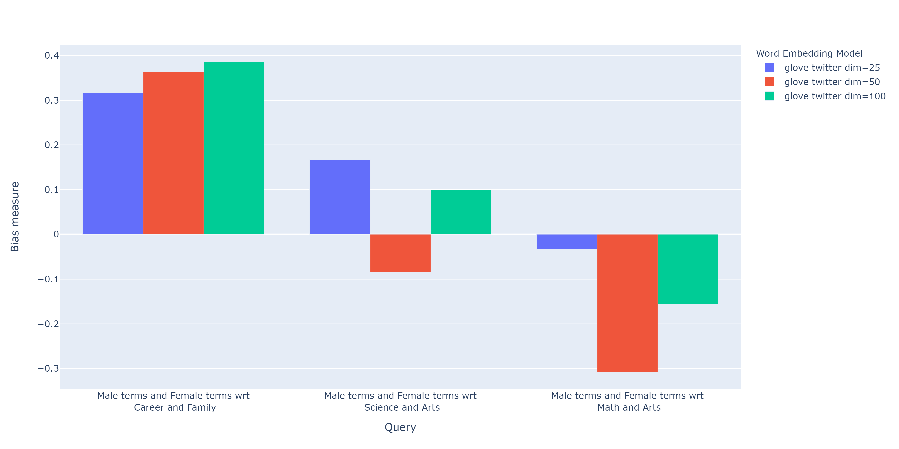
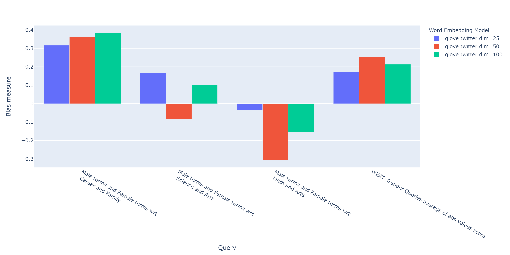
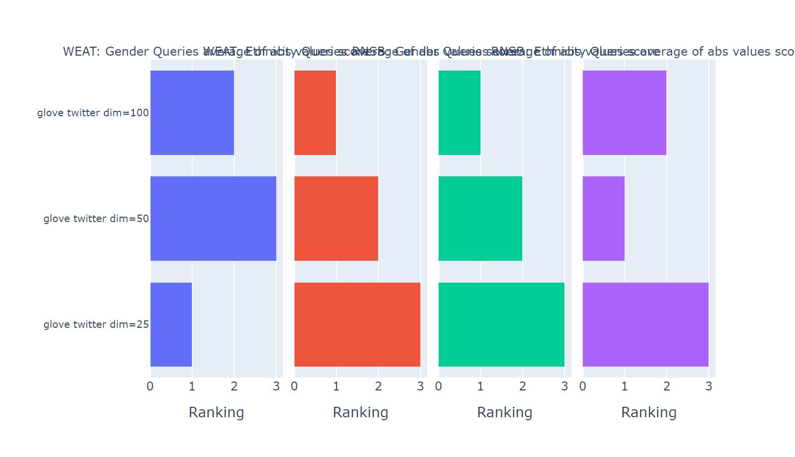
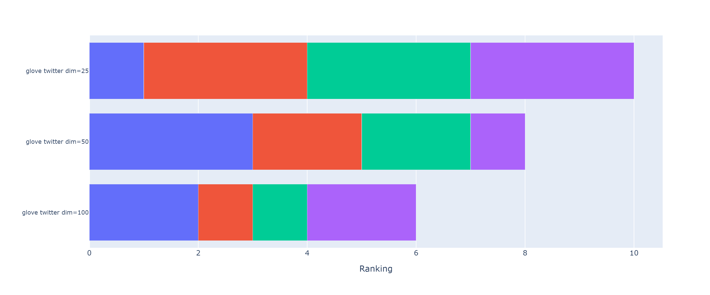

==========
User guide
==========

The following guide is designed to present the more general details about how 
to use the package. Below:

- First, we will present how to run a simple query using some embedding model. 
- Then, we will show how to run multiple queries on multiple embeddings.
- After that, we will show how to compare the results obtained from running 
  multiple sets of queries on multiple embeddings using different metrics 
  through ranking calculation.
- Finally, we will show how to calculate the correlations between the 
  rankings obtained.

.. warning::

  If you are not familiar with the concepts of  query, target and attribute 
  set, please visit the `the framework section <index.html#the-framework>`_ 
  on the library's about page. 
  These concepts will be widely used in the following sections.

You can find this guide ready to run in the following 
`Jupyter Notebook <https://github.com/dccuchile/wefe/blob/master/examples/User_Guide.ipynb>`_. 

Run a Query
===========

The following code will show how to run a gender query using Glove embeddings
and the Word Embedding Association Test (WEAT) as fairness metric.

Below we show the three usual steps for performing a query in WEFE:

>>> # Load the modules
>>> from wefe.query import Query
>>> from wefe.word_embedding_model import WordEmbeddingModel
>>> from wefe.metrics.WEAT import WEAT
>>> from wefe.datasets.datasets import load_weat
>>> import gensim.downloader as api

1. Load a word embeddings model as a :code:`WordEmbeddingModel` object.

Here, we will load the word embedding pretrained model using the gensim library
and then we will create a :code:`WordEmbeddingModel` instance.
For this example, we will use a 25-dimensional Glove embedding model trained
from a Twitter dataset.

>>> twitter_25 = api.load('glove-twitter-25')
>>> model = WordEmbeddingModel(twitter_25, 'glove twitter dim=25')

2. Create the query using a ``Query`` object

Define the target and attribute words sets and create a ``Query`` object that 
contains them.
Some well-known word sets are already provided by the package and can be easily
loaded by the user. 
Users can also set their own custom-made sets.

For this example, we will create a query with gender terms with respect to 
family and career.  The words we will use will be taken from the set of words
used in the WEAT paper (included in the package).

>>> # load the weat word sets
>>> word_sets = load_weat()
>>> 
>>> query = Query([word_sets['male_terms'], word_sets['female_terms']],
>>>               [word_sets['career'], word_sets['family']],
>>>               ['Male terms', 'Female terms'], ['Career', 'Family'])

3. Instantiate the Metric

Instantiate the metric that you will use and then execute ``run_query``
with the  parameters created in the previous steps. In this case we will 
use the ``WEAT`` metric. 

>>> weat = WEAT()
>>> result = weat.run_query(query, model)
>>> print(result)
{'query_name': 'Male Terms and Female Terms wrt Arts and Science',
 'result': -0.010003209}

Running multiple Queries
========================

We usually want to test several queries that study some **criterion**
of bias: *gender, ethnicity, religion, politics, socioeconomic, among others*.
Let's suppose you've created 20 queries that study gender bias on different
models of embeddings.
Trying to ``run_query`` on each pair embedding-query can be a bit complex and 
will require extra work to implement.

This is why the library also implements a function to test multiple queries 
on various word embedding models in a single call: the ``run_queries`` util.

The following code shows how to run various gender queries
on different Glove embedding models trained from the Twitter dataset. 
The queries will be executed using the Effect size variant of WEAT.

>>> from wefe.query import Query
>>> from wefe.datasets import load_weat
>>> from wefe.word_embedding_model import WordEmbeddingModel
>>> from wefe.metrics import WEAT, RNSB
>>> from wefe.utils import run_queries, plot_queries_results
>>> 
>>> import gensim.downloader as api

1. Load the models:

Load three different Glove Twitter embedding models. These models were trained
using the same dataset varying the number of embedding dimensions. 

>>> model_1 = WordEmbeddingModel(api.load('glove-twitter-25'),
>>>                              'glove twitter dim=25')
>>> model_2 = WordEmbeddingModel(api.load('glove-twitter-50'),
>>>                              'glove twitter dim=50')
>>> model_3 = WordEmbeddingModel(api.load('glove-twitter-100'),
>>>                              'glove twitter dim=100')
>>> 
>>> models = [model_1, model_2, model_3]

2. Load the word sets:

Now, we will load the WEAT word set and create three 
queries. The first query is intended to measure gender bias and the other two 
are intended to measure ethnicity bias.

>>> # Load the WEAT word sets
>>> word_sets = load_weat()
>>> 
>>> # Create gender queries
>>> gender_query_1 = Query([word_sets['male_terms'], word_sets['female_terms']],
>>>                        [word_sets['career'], word_sets['family']],
>>>                        ['Male terms', 'Female terms'], ['Career', 'Family'])
>>> gender_query_2 = Query([word_sets['male_terms'], word_sets['female_terms']],
>>>                        [word_sets['science'], word_sets['arts']],
>>>                        ['Male terms', 'Female terms'], ['Science', 'Arts'])
>>> gender_query_3 = Query([word_sets['male_terms'], word_sets['female_terms']],
>>>                        [word_sets['math'], word_sets['arts_2']],
>>>                        ['Male terms', 'Female terms'], ['Math', 'Arts'])
>>> 
>>> gender_queries = [gender_query_1, gender_query_2, gender_query_3]

3. Run the queries on all Word Embeddings using ``WEAT Effect Size``. 

Now, to run our list of queries and models, we will call the function 
``run_queries``. The mandatory parameters of the function are 3: 

1. a metric,
2. a list of queries, and,
3. a list of embedding models. 

It is also possible to provide a name for the for the criterion studied in 
this set of queries through the parameter ``queries_set_name``.

.. note::
  Notice that you can pass metric's parameters using a dict object in the 
  :code:`metric_params` parameter.
  In this case, we specify that ``WEAT`` returns its Effect size variant 
  as result by delivering the following parameter to ``run_queries``:
  ``metric_params={'return_effect_size': True}``

>>> # Run the queries
>>> WEAT_gender_results = run_queries(WEAT,
>>>                                   gender_queries,
>>>                                   models,
>>>                                   metric_params={'return_effect_size': True},
>>>                                   queries_set_name='Gender Queries')
>>> WEAT_gender_results

=====================  ===================================================  ==================================================  ===============================================
Model name               Male terms and Female terms wrt Career and Family    Male terms and Female terms wrt Science and Arts    Male terms and Female terms wrt Math and Arts
=====================  ===================================================  ==================================================  ===============================================
glove twitter dim=25                                              0.715369                                            0.766402                                         0.121468
glove twitter dim=50                                              0.799666                                           -0.660553                                        -0.589894
glove twitter dim=100                                             0.681933                                            0.641153                                        -0.399822
=====================  ===================================================  ==================================================  ===============================================

.. warning::

  If more than 20% (by default) of the words from any of the word 
  sets of the query are not included in the word embedding model, the metric 
  will return :code:`Nan`.
  This behavior can be changed using a float number parameter called 
  :code:`lost_vocabulary_threshold`. 

4. Plot the results in a barplot:

>>> # Plot the results
>>> plot_queries_results(WEAT_gender_results).show()

5. Aggregating Results:

The execution of ``run_queries`` in the previous step gave us many results 
evaluating the gender bias in the tested embeddings.
However, these don't tell us much about the overall fairness of 
the embedding models with respect to the criteria evaluated.
Therefore, we would like to have some mechanism that allows us to aggregate 
the results directly obtained in ``run_query`` so that we can evaluate the 
bias as a whole.

For this, when using ``run_queries``, you must set the ``aggregate_results`` 
parameter as ``True``. 
This default value will activate the option to aggregate the results by 
averaging the absolute values of the results and put them in the last column.

This aggregation function can be modified through the ``aggregation_function``
parameter. 
Here you can specify a string that defines some of the aggregation types that 
are already implemented, as well as provide a function that operates in the 
results dataframe.

The aggregation functions available are:

- Average ``avg``.
- Average of the absolute values ``abs_avg``.
- Sum ``sum``.
- Sum of the absolute values, ``abs_sum``.

.. note::

  Notice that some functions are more appropriate for certain metrics. For 
  metrics returning only positive numbers, all the previous aggregation 
  functions would be OK. In contrast, for metrics returning real values 
  (e.g., ``WEAT``, ``RND``), aggregation functions such as 
  ``sum`` would make different outputs to cancel each other.

Let's aggregate the results from previous example by the average of the absolute values:

>>> WEAT_gender_results_agg = run_queries(WEAT,
>>>                                   gender_queries,
>>>                                   models,
>>>                                   metric_params={'return_effect_size': True},
>>>                                   aggregate_results=True,
>>>                                   aggregation_function='abs_avg',
>>>                                   queries_set_name='Gender Queries')
>>> WEAT_gender_results_agg

=====================  ===================================================  ==================================================  ===============================================  ==================================================
model_name               Male terms and Female terms wrt Career and Family    Male terms and Female terms wrt Science and Arts    Male terms and Female terms wrt Math and Arts    WEAT: Gender Queries average of abs values score
=====================  ===================================================  ==================================================  ===============================================  ==================================================
glove twitter dim=25                                              0.715369                                            0.766402                                         0.121468                                            0.534413
glove twitter dim=50                                              0.799666                                           -0.660553                                        -0.589894                                            0.683371
glove twitter dim=100                                             0.681933                                            0.641153                                        -0.399822                                            0.574303
=====================  ===================================================  ==================================================  ===============================================  ==================================================

Finally, we can ask the function to return only the aggregated values 
(through :code:`return_only_aggregation` parameter) and then plot them.

>>> WEAT_gender_results_agg = run_queries(WEAT,
>>>                                   gender_queries,
>>>                                   models,
>>>                                   metric_params={'return_effect_size': True},
>>>                                   aggregate_results=True,
>>>                                   aggregation_function='abs_avg',
>>>                                   return_only_aggregation=True,
>>>                                   queries_set_name='Gender Queries')
>>> WEAT_gender_results_agg
>>> plot_queries_results(WEAT_gender_results_agg).show()

Calculate Rankings
==================

When we want to measure various criteria of bias in different embedding models, 
two major problems arise:

1. One type of bias can dominate the other because of significant
differences in magnitude.

2. Different metrics can operate on different scales, which makes them
difficult to compare.

To show that, suppose we have two sets of queries: one that explores gender
biases and another that explores ethnicity biases, and we want to test
these sets of queries on 3 Twitter Glove models of 25, 50 and 100
dimensions each, using both WEAT and Relative Negative Sentiment Bias 
(:code:`RNSB`) as bias metrics.

1. Let's show the first problem: the bias scores obtained from one set
of queries are much higher than those
from the other set, even when the same metric is used.

We will execute the gender and ethnicity queries using WEAT and the 3 models
mentioned above. The results obtained are:

=====================  ==================================================  =====================================================
model_name               WEAT: Gender Queries average of abs values score    WEAT: Ethnicity Queries average of abs values score
=====================  ==================================================  =====================================================
glove twitter dim=25                                             0.210556                                                2.64632
glove twitter dim=50                                             0.292373                                                1.87431
glove twitter dim=100                                            0.225116                                                1.78469
=====================  ==================================================  =====================================================

As can be seen, the results of ethnicity bias are much greater than those
of gender.

2. For the second problem: Metrics deliver their results on different
scales.

We will execute the gender queries using WEAT and RNSB metrics and the 3
models mentioned above. The results obtained are:

=====================  ==================================================  ==================================================
model_name               WEAT: Gender Queries average of abs values score    RNSB: Gender Queries average of abs values score
=====================  ==================================================  ==================================================
glove twitter dim=25                                             0.210556                                           0.032673
glove twitter dim=50                                             0.292373                                           0.049429
glove twitter dim=100                                            0.225116                                           0.0312772
=====================  ==================================================  ==================================================

We can see differences between the results of both metrics of an order
of magnitude.

To address these two problems, we propose to create *rankings*.
Rankings allow us to focus on the relative differences reported by the
metrics (for different models) instead of focusing on the absolute values.

Now, let's create rankings using the data used above.
The following code will load the models and create the queries:

>>> from wefe.query import Query
>>> from wefe.datasets.datasets import load_weat
>>> from wefe.word_embedding_model import WordEmbeddingModel
>>> from wefe.metrics import WEAT, RNSB
>>> from wefe.utils import run_queries, create_ranking, plot_ranking, plot_ranking_correlations
>>> 
>>> import gensim.downloader as api
>>> 
>>> # Load the models
>>> model_1 = WordEmbeddingModel(api.load('glove-twitter-25'),
>>>                              'glove twitter dim=25')
>>> model_2 = WordEmbeddingModel(api.load('glove-twitter-50'),
>>>                              'glove twitter dim=50')
>>> model_3 = WordEmbeddingModel(api.load('glove-twitter-100'),
>>>                              'glove twitter dim=100')
>>> 
>>> models = [model_1, model_2, model_3]
>>> 
>>> 
>>> # Load the WEAT word sets
>>> word_sets = load_weat()
>>> 
>>> # Create gender queries
>>> gender_query_1 = Query([word_sets['male_terms'], word_sets['female_terms']],
>>>                        [word_sets['career'], word_sets['family']],
>>>                        ['Male terms', 'Female terms'], ['Career', 'Family'])
>>> gender_query_2 = Query([word_sets['male_terms'], word_sets['female_terms']],
>>>                        [word_sets['science'], word_sets['arts']],
>>>                        ['Male terms', 'Female terms'], ['Science', 'Arts'])
>>> gender_query_3 = Query([word_sets['male_terms'], word_sets['female_terms']],
>>>                        [word_sets['math'], word_sets['arts_2']],
>>>                        ['Male terms', 'Female terms'], ['Math', 'Arts'])
>>> 
>>> # Create ethnicity queries
>>> ethnicity_query_1 = Query([word_sets['european_american_names_5'],
>>>                            word_sets['african_american_names_5']],
>>>                           [word_sets['pleasant_5'], word_sets['unpleasant_5']],
>>>                           ['European Names', 'African Names'],
>>>                           ['Pleasant', 'Unpleasant'])
>>> 
>>> ethnicity_query_2 = Query([word_sets['european_american_names_7'],
>>>                            word_sets['african_american_names_7']], 
>>>                           [word_sets['pleasant_9'], word_sets['unpleasant_9']],
>>>                           ['European Names', 'African Names'],
>>>                           ['Pleasant 2', 'Unpleasant 2'])
>>> 
>>> gender_queries = [gender_query_1, gender_query_2, gender_query_3]
>>> ethnicity_queries = [ethnicity_query_1, ethnicity_query_2]

Now, we will run the queries with :code:`WEAT` and :code:`RNSB`:

>>> # Run the queries WEAT
>>> WEAT_gender_results = run_queries(WEAT,
>>>                                   gender_queries,
>>>                                   models,
>>>                                   aggregate_results=True,
>>>                                   return_only_aggregation=True,
>>>                                   
>>>                                   queries_set_name='Gender Queries')
>>> 
>>> WEAT_ethnicity_results = run_queries(WEAT,
>>>                                      ethnicity_queries,
>>>                                      models,
>>>                                      aggregate_results=True,
>>>                                      return_only_aggregation=True,
>>>                                      queries_set_name='Ethnicity Queries')
>>>

>>> # Run the queries using RNSB
>>> RNSB_gender_results = run_queries(RNSB,
>>>                                   gender_queries,
>>>                                   models,
>>>                                   aggregate_results=True, 
>>>                                   return_only_aggregation=True,
>>>                                   queries_set_name='Gender Queries')
>>> 
>>> RNSB_ethnicity_results = run_queries(RNSB,
>>>                                      ethnicity_queries,
>>>                                      models,
>>>                                      aggregate_results=True,
>>>                                      return_only_aggregation=True,
>>>                                      queries_set_name='Ethnicity Queries')

   
To create the ranking we'll use the :code:`create_ranking` function.
This function takes all the DataFrames containing the calculated scores and 
uses the last column to create the ranking. It assumes that the scores are 
already aggregated.

>>> ranking = create_ranking([
>>>     WEAT_gender_results, WEAT_ethnicity_results, RNSB_gender_results,
>>>     RNSB_ethnicity_results
>>> ])
>>>
>>> ranking

=====================  ==================================================  =====================================================  ==================================================  =====================================================
model_name               WEAT: Gender Queries average of abs values score    WEAT: Ethnicity Queries average of abs values score    RNSB: Gender Queries average of abs values score    RNSB: Ethnicity Queries average of abs values score
=====================  ==================================================  =====================================================  ==================================================  =====================================================
glove twitter dim=25                                                    1                                                      3                                                   3                                                      3
glove twitter dim=50                                                    3                                                      2                                                   2                                                      1
glove twitter dim=100                                                   2                                                      1                                                   1                                                      2
=====================  ==================================================  =====================================================  ==================================================  =====================================================

Finally, we can plot the rankings using the :code:`plot_ranking` function.
The function can be used in two ways:

1. With facet by Metric and Criteria:

This image shows the rankings separated by each bias criteria and metric
(i.e, by each column).
Each bar represents the position of the embedding in the corresponding
criterion-metric ranking.

>>> plot_ranking(ranking, use_metric_as_facet=True)

2. Without facet:

>>> plot_ranking(ranking)

This image shows the accumulated rankings for each embedding model.
Each bar represents the sum of the rankings obtained by each embedding.
Each color within a bar represents a different criterion-metric ranking.

Ranking Correlations
====================

We can see how the rankings obtained in the previous section relate to
each other by using a correlation matrix.
To do this we provide a function called :code:`calculate_ranking_correlations`.
This function takes the rankings as input and calculates the Spearman
correlation between them.

>>> from wefe.utils import calculate_ranking_correlations, plot_ranking_correlations
>>> correlations = calculate_ranking_correlations(ranking)
>>> correlations

===================================================  ==================================================  =====================================================  ==================================================  =====================================================
model                                                WEAT: Gender Queries average of abs values score    WEAT: Ethnicity Queries average of abs values score    RNSB: Gender Queries average of abs values score    RNSB: Ethnicity Queries average of abs values score
===================================================  ==================================================  =====================================================  ==================================================  =====================================================
WEAT: Gender Queries average of abs values score                                                    1                                                     -0.5                                                -0.5                                                   -1
WEAT: Ethnicity Queries average of abs values score                                                -0.5                                                    1                                                   1                                                      0.5
RNSB: Gender Queries average of abs values score                                                   -0.5                                                    1                                                   1                                                      0.5
RNSB: Ethnicity Queries average of abs values score                                                -1                                                      0.5                                                 0.5                                                    1
===================================================  ==================================================  =====================================================  ==================================================  =====================================================

Finally, we also provide a function to graph the correlations. This function
enables us to visually analyze how the rankings relate to each other.

>>> correlation_fig = plot_ranking_correlations(correlations)
>>> correlation_fig.show()

.. image:: images/ranking_correlations.png
  :alt: Ranking without facet
