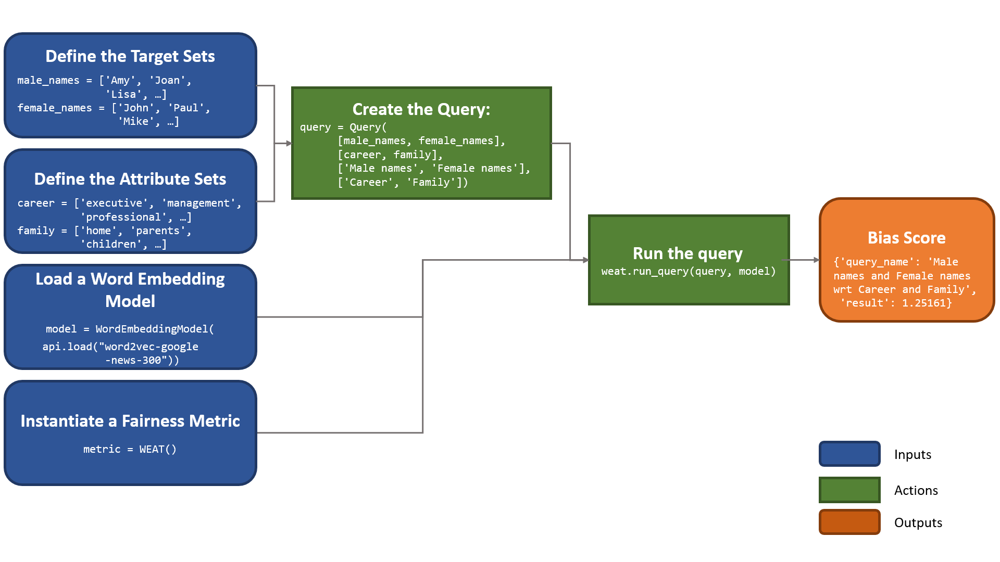

.. _measurement framework:

Measurement Framework
=====================

Below we present the main aspects of the measurement framework developed at WEFE. 

.. note::
   
   If you want to see tutorials on how to apply queries, visit :ref:`bias measurement` 
   in the User Guide.

Target set 
----------

A target word set (denoted by :math:`T`) corresponds to a 
set of words intended to denote a particular social group,which is defined by a 
certain criterion. This criterion can be any character, trait or origin that 
distinguishes groups of people from each other e.g., gender, social class, age, 
and ethnicity. For example, if the criterion is gender we can use it to 
distinguish two groups, `women and men`. Then, a set of target words 
representing the social group "*women*" could contain words like *'she'*, 
*'woman'*, *'girl'*, etc. Analogously  a set of target words the representing the 
social group '*men'* could include *'he'*, *'man'*, *'boy'*, etc.

Attribute set
-------------

An attribute word set (denoted by :math:`A`) is a set of words 
representing some attitude, characteristic, trait, occupational field, etc.  
that  can  be  associated  with individuals from any social group. For example,
the set of *science* attribute  words  could  contain  words  such as  
*'technology'*, *'physics'*, *'chemistry'*, while the *art* attribute words could have
words like *'poetry'*,  *'dance'*,  *'literature'*.

Query
-----

Queries are the main building blocks used by fairness metrics to measure bias 
of word embedding models. 
Formally, a query is a pair :math:`Q=(\mathcal{T},\mathcal{A})` in which 
:math:`T` is a set of target word sets, and :math:`A` is a set of attribute 
word sets. For example, consider the target word sets:

.. math::

   \begin{eqnarray*}
   T_{\text{women}} & = & \{{she},{woman},{girl}, \ldots\}, \\
   T_{\text{men}} & = & \{{he},{man},{boy}, \ldots\},
   \end{eqnarray*}

and the attribute word sets

.. math::

   \begin{eqnarray*}
   A_{\text{science}} & = & \{{math},{physics},{chemistry}, \ldots\}, \\
   A_{\text{art}} & = & \{{poetry},{dance},{literature}, \ldots\}.
   \end{eqnarray*}

Then the following is a query in our framework

.. math::

   \begin{equation}
   Q=(\{T_{\text{women}}, T_{\text{men}}\},\{A_{\text{science}},A_{\text{art}}\}).
   \end{equation}

When a set of queries :math:`\mathcal{Q} = {Q_1, Q_2, \dots, Q_n}` is intended
to measure a single type of bias, we say that the set has a 
**Bias Criterion**.  
Examples of bias criteria are gender, ethnicity, religion, politics, 
social class, among others.

.. warning::

  To accurately study the biases contained in word embeddings, queries may 
  contain words that could be offensive to certain groups or individuals. 
  The relationships studied between these words DO NOT represent the ideas, 
  thoughts or beliefs of the authors of this library.  
  This warning applies to all documentation.

Query Template
--------------

A query template is simply a pair :math:`(t,a)\in\mathbb{N}\times\mathbb{N}`.
We say that query :math:`Q=(\mathcal{T},\mathcal{A})` satisfies a 
template :math:`(t,a)` if :math:`|\mathcal{T}|=t` and :math:`|\mathcal{A}|=a`.

Fairness Measure
----------------

A fairness metric is a function that quantifies the degree of association 
between target and attribute words in a word embedding model. 
In our framework, every fairness metric is defined as a function that has a 
query and a model as input, and produces a real number as output.

Several fairness metrics have been proposed in the literature.
But not all of them share a common input template for queries.
Thus, we assume that every fairness metric comes with a template that 
essentially defines the shape of the input queries supported by the metric. 

Formally, let :math:`F` be a fairness metric with template :math:`s_F=(t_F,a_F)`. 
Given an embedding model :math:`\mathbf{M}` and a query :math:`Q` that 
satisfies :math:`s_F`, the metric produces the value 
:math:`F(\mathbf{M},Q)\in \mathbb{R}` that quantifies the degree of bias of 
:math:`\mathbf{M}` with respect to query :math:`Q`.

Standard usage pattern of WEFE
-------------------------------

The following flow chart shows how to perform a bias measurement using a gender
query, word2vec embeddings and the WEAT metric.
   

To see the implementation of this query using WEFE, refer to 
the :ref:`Quick start <quick_start>` section.

Metrics Implemented So Far
--------------------------

WEFE implements the following bias measurement metrics: 

- Word Embedding Association Test (:class:`~wefe.metrics.WEAT.WEAT`)
- Relative Norm Distance (:class:`~wefe.metrics.RND.RND`)
- Relative Negative Sentiment Bias (:class:`~wefe.metrics.RNSB.RNSB`)
- Mean Average Cosine Similarity (:class:`~wefe.metrics.MAC.MAC`)
- Embedding Coherence Test (:class:`~wefe.metrics.ECT.ECT`)
- Relational Inner Product Association (:class:`~wefe.metrics.RIPA.RIPA`)
