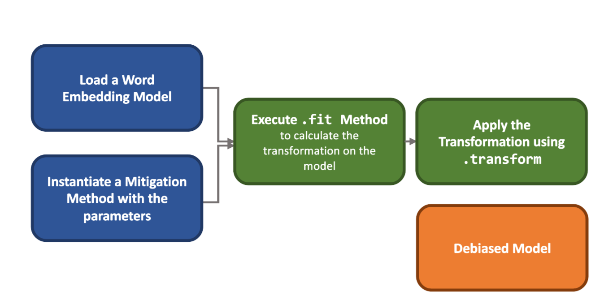

.. _mitigation framework:

Mitigation Framework
====================

.. note::
   If you want to see tutorials on how to mitigate (debias) bias in word embedding 
   models, visit :ref:`Bias Mitigation <bias mitigation>` in the User Guide.

WEFE standardizes all mitigation methods through an interface inherited from 
``scikit-learn`` basic data transformations: the ``fit-transform`` interface. 

Fit method
----------

The first step ``fit``, consists in learning the corresponding mitigation transformation 
which usually corresponds to a matrix projection of the embedding space. 
This method is quite flexible: it can accept multiple sets of words and other parameters. 

Transform method
----------------

The ``transform`` method applies the transformation learned in the previous step to
words residing in the original embedding space. The method is rigid and only accepts 
lists of words that should be mitigated (``target``) or words that should be omitted 
(``ignore``).

The process by which debiasing methods are used is shown in the following Figure.

Mitigation Methods Implemented So Far
-------------------------------------

WEFE implements the following bias mitigation (debias) metrics: 

- :class:`~wefe.debias.hard_debias.HardDebias`, 
- :class:`~wefe.debias.multiclass_hard_debias.MulticlassHardDebias`,
- :class:`~wefe.debias.double_hard_debias.DoubleHardDebias`,
- :class:`~wefe.debias.repulsion_attraction_neutralization.RepulsionAttractionNeutralization`,
- :class:`~wefe.debias.half_sibling_regression.HalfSiblingRegression`,

Except for ``MulticlassHardDebias``, all methods are limited to binary criteria, 
such gender.